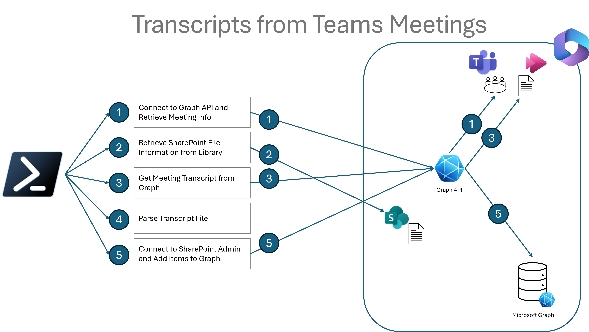
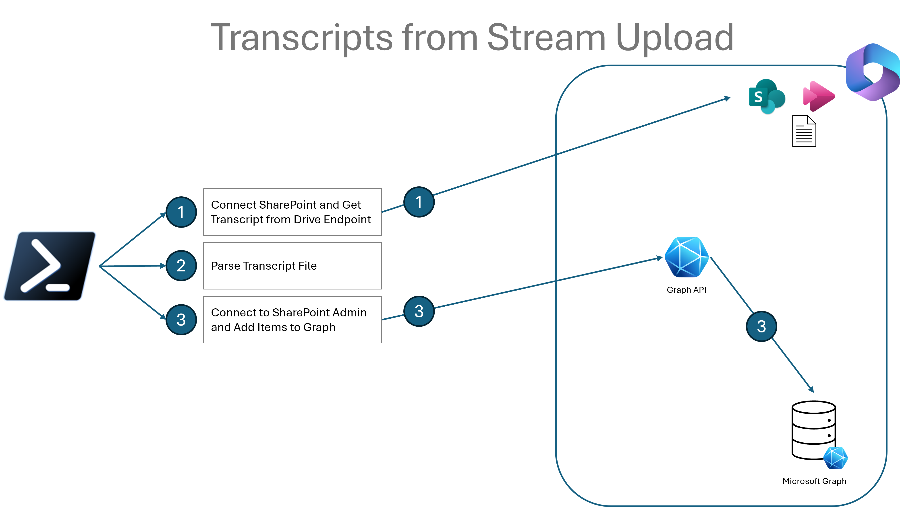

# Teams Transcripts to Graph PowerShell

This repository contains PowerShell scripts to manage and process transcripts from video recordings and add them to Microsoft Graph for enhanced searchability. There are two distinct paths you can take depending on the source of your recordings.

Note that the External Graph Connection needs to be set up prior to

## Two Approaches

1. [**Teams Meeting Recordings**](#approach-1-process-teams-meeting-recordings) - Use `Add-TranscriptsToGraphForTeamsMeeting.ps1` for videos that were recorded as part of Teams meetings
2. [**Stream Uploads**](#approach-2-process-stream-upload-videos) - Use `Add-TranscriptsToGraphForStreamUpload.ps1` for videos that were recorded outside of Teams and uploaded to Stream

## Prerequisites

- PowerShell 7.0 or later
- Modules:
  - `PnP.PowerShell`
  - `Microsoft.Graph`
  - `MicrosoftTeams`
- Entra App Registration with appropriate permissions (details below)
- Videos accessible via Microsoft Stream (required for URLs with timestamps and transcript generation)

**If you run into issues with conflicts between PnP.PowerShell and Microsoft.Graph, check out <https://github.com/TobiasAT/PowerShell/blob/main/Documentation/Resolve-TAPnPPowerShellConflicts.md>.**

## Scripts Overview

| Script Name| Description  |
| --- |---|
| `Add-TranscriptsToGraphForTeamsMeeting.ps1` | Main script for processing Teams meeting recordings. |
| `Add-TranscriptsToGraphForStreamUpload.ps1` | Script for processing videos recorded outside Teams and uploaded to Stream. |
| `Get-MeetingRecordingInfo.ps1` | Retrieves information about Microsoft Teams meeting recordings. |
| `Get-OnlineMeetingRecordingSharePointFileInfo.ps1` | Retrieves information about the SharePoint file associated with a Microsoft Teams meeting recording. |
| `Get-MeetingTranscript.ps1` | Retrieves the transcript file for a Microsoft Teams meeting. |
| `Add-TranscriptItemsToGraph.ps1` | Adds the formatted transcript items to Microsoft Graph. Supports video categorization. |
| `Get-StreamTranscriptViaSharePoint.ps1` | Retrieves the transcript files for Microsoft Stream videos stored in a SharePoint document library. |
| `Get-WebVTTContent.ps1` | Processes WebVTT files and extracts transcript data, optionally grouping sentences into segments. |

# One-time Graph Connector Setup

Before using either of the approaches, you need to set up a Microsoft Graph connector to index and make the transcript data searchable. The [`ConfigureSearchConnection.ps1`](ConfigureSearchConnection.ps1) script creates the necessary search connection and schema.

## Required Permissions

- Microsoft Graph: ExternalConnection.ReadWrite.OwnedBy or ExternalConnection.ReadWrite.All

## Steps

1. Review and modify the connection details in the script:
   - `$searchExternalConnectionName` - A display name for your connection
   - `$searchExternalConnectionId` - A unique identifier for the connection
   - `$searchExternalConnectionDescription` - A description of the indexed content

2. Run the script to create the connection and set up the schema.

3. The script defines schema properties for:

    | Schema Property Name | Type       | Description                                                                |
    |----------------------|------------|----------------------------------------------------------------------------|
    | SegmentID            | String     | Unique identifier for each transcript segment.                             |
    | SegmentTitle         | String     | Title or label for the transcript segment.                                 |
    | SegmentStartTime     | DateTime   | Start time of the transcript segment.                                      |
    | SegmentEndTime       | DateTime   | End time of the transcript segment.                                        |
    | MeetingSubject       | String     | Subject or title of the meeting.                                           |
    | MeetingStartTime     | DateTime   | Start time of the meeting.                                                 |
    | MeetingEndTime       | DateTime   | End time of the meeting.                                                   |
    | MeetingOrganizer     | String     | Name or email of the meeting organizer.                                    |
    | FileName             | String     | Name of the associated file .                                              |
    | FileExtension        | String     | File extension (e.g. `.mp4`, `.avi`).                                      |
    | FileUrl              | String     | URL to access the file in SharePoint or another storage location.          |
    | TranscriptContent    | String     | Text content of the transcript.                                            |
    | SpeakerNames         | Array      | List of speaker names associated with the transcript content.              |
    | Category             | String     | Category or classification for organizing the transcript or video content. |

4. Note the `$searchExternalConnectionId` value - you'll need this when running the transcript processing scripts.

# Approach 1: Process Teams Meeting Recordings



## Process Overview

The `Add-TranscriptsToGraphForTeamsMeeting.ps1` script follows these steps:

1. **Connect to Graph API and Get Meeting Info**
    - [1a. Connect to Graph API](#step-1a-connect-to-graph-api)  
    - [1b. Get Meeting Recording Information](#step-1b-get-meeting-recording-information)  
2. [**Get SharePoint File Information**](#step-2-get-sharepoint-file-information)  
3. [**Download Meeting Transcript**](#step-3-download-meeting-transcript)  
4. [**Process Transcript Data**](#step-4-process-transcript-data)  
5. **Connect to SharePoint Admin and Add Transcript Items to Graph**
    - [5a. Connect to SharePoint Admin](#step-5a-connect-to-sharepoint-admin)  
    - [5b. Add Transcript Items to Graph](#step-5b-add-transcript-items-to-graph)

## Detailed Process

### STEP 1a: Connect to Graph API

Uses Microsoft Graph API to authenticate and establish connection.

**Required Permissions:**

| API              | Type         | Permission                  | Description                                                                     |
|------------------|--------------|-----------------------------|---------------------------------------------------------------------------------|
| Microsoft Graph  | Application  | User.Read.All               | Allows the app to read user properties                                          |
| Microsoft Graph  | Application  | OnlineMeetings.ReadWrite    | Allows the app to read and create online meetings on your behalf.               |

#### Example: Connect to Microsoft Graph API using Client ID, Tenant ID, and Certificate

``` PowerShell
# Define variables
$ClientId = "<Your-Client-ID>"
$TenantId = "<Your-Tenant-ID>"
$CertificateThumbprint = "<Your-Certificate-Thumbprint>"

# Import the Microsoft Graph module
Import-Module Microsoft.Graph

# Authenticate with Microsoft Graph using certificate-based authentication
Connect-MgGraph -ClientId $ClientId -TenantId $TenantId -CertificateThumbprint $CertificateThumbprint
```

### STEP 1b: Get Meeting Recording Information

Uses [`Get-MeetingRecordingInfo.ps1`](Get-MeetingRecordingInfo.ps1 ) to retrieve information about the Teams meeting recording.

**Inputs:**

| Input Name             | Type   | Notes                          |
|------------------------|--------|--------------------------------|
| meetingOrganizerUserId | String | Organizer's UPN or Entra ID    |
| startDateTime          | String | Start Time of the Search Range |
| endDateTime            | String | End Time of the Search Range   |
| MeetingSubject         | String | Subject of the Meeting         |

**Outputs:**

- `meetingRecordingInfo`: Object containing meeting host, ID, and content correlation ID.

#### Example: Retrieve meeting recording information using Get-MeetingRecordingInfo.ps1

```powershell
# Define input parameters
$meetingOrganizerUserId = "organizer@contoso.com"
$startDateTime = "2023-01-01T00:00:00Z"
$endDateTime = "2023-01-31T23:59:59Z"
$MeetingSubject = "Quarterly Business Review"

# Run the script
$meetingRecordingInfo = .\Get-MeetingRecordingInfo.ps1 -meetingOrganizerUserId $meetingOrganizerUserId `
  -startDateTime $startDateTime -endDateTime $endDateTime -MeetingSubject $MeetingSubject
```

### STEP 2: Get SharePoint File Information

Uses [`Get-OnlineMeetingRecordingSharePointFileInfo.ps1`](Get-OnlineMeetingRecordingSharePointFileInfo.ps1 ) to locate the recording file in SharePoint.

**Required Permissions:**

| API             | Type         | Permission     | Description                            |
|-----------------|--------------|----------------|----------------------------------------|
| Microsoft Graph | Application  | User.Read.All  | Allows the app to read user properties |
| SharePoint      | Application  | Sites.Read.All | Read items in all site collections     |

**Inputs:**

| Input Name                    | Type   | Notes                                      |
|-------------------------------|--------|--------------------------------------------|
| OneDriveBaseUrl               | String | BaseUrl of OneDrive                        |
| OneDriveRecordingsLibraryName | String | Library name where recordings are stored   |
| meetingOrganizerUserUpn       | String | UPN of the meeting organizer               |
| MeetingSubject                | String | Subject of the meeting                     |
| ClientId                      | String | App registration client ID                 |
| Tenant                        | String | Tenant name                                |
| CertificateThumbprint         | String | Certificate thumbprint for authentication  |

**Outputs:**

- `recordingFileInfo`: Object with file details (URL, name, type, etc.)

#### Example: Retrieve SharePoint file information using Get-OnlineMeetingRecordingSharePointFileInfo.ps1

```powershell
# Define input parameters
$OneDriveBaseUrl = "https://contoso-my.sharepoint.com"
$OneDriveRecordingsLibraryName = "Recordings"
$meetingOrganizerUserUpn = "organizer@contoso.com"
$MeetingSubject = "Quarterly Business Review"
$ClientId = "<Your-Client-ID>"
$Tenant = "<Your-Tenant-Name>"
$CertificateThumbprint = "<Your-Certificate-Thumbprint>"

# Run the script
$recordingFileInfo = .\Get-OnlineMeetingRecordingSharePointFileInfo.ps1 -OneDriveBaseUrl $OneDriveBaseUrl `
  -OneDriveRecordingsLibraryName $OneDriveRecordingsLibraryName `
  -meetingOrganizerUserUpn $meetingOrganizerUserUpn `
  -MeetingSubject $MeetingSubject `
  -ClientId $ClientId `
  -Tenant $Tenant `
  -CertificateThumbprint $CertificateThumbprint
```

### STEP 3: Download Meeting Transcript

Uses [`Get-MeetingTranscript.ps1`](Get-MeetingTranscript.ps1 ) to download the transcript file.

**Required Permissions:**

| API              | Type         | Permission                       | Description                                                                |
|------------------|--------------|----------------------------------|----------------------------------------------------------------------------|
| Microsoft Graph  | Application  | User.Read.All                    | Allows the app to read user properties                                     |
| Microsoft Graph  | Application  | OnlineMeetings.ReadWrite         | Allows the app to read and create online meetings on your behalf.          |
| Microsoft Graph  | Application  | OnlineMeetingTranscript.Read.All | Allows the app to read all transcripts of online meetings, on your behalf. |

**Inputs:**

| Input Name             | Type   | Notes                                   |
|------------------------|--------|-----------------------------------------|
| meetingOrganizerUserId | String | The UPN of the meeting organizer        |
| meetingId              | String | The ID of the meeting                   |
| meetingSubject         | String | The subject of the meeting              |
| transcriptFilePath     | String | Local path to save transcript file      |
| ContentCorrelationId   | String | Content correlation ID of the meeting   |

**Outputs:**

- `transcriptFile`: Path to the downloaded transcript file

#### Example: Retrieve transcript file using Get-MeetingTranscript.ps1

```powershell
# Define input parameters
$meetingOrganizerUserId = "organizer@contoso.com"
$meetingId = "12345-abcde-67890-fghij"
$meetingSubject = "Quarterly Business Review"
$transcriptFilePath = "C:\Transcripts\MeetingTranscript.vtt"
$ContentCorrelationId = "abcdef1234567890"

# Run the script
$transcriptFile = .\Get-MeetingTranscript.ps1 -meetingOrganizerUserId $meetingOrganizerUserId `
  -meetingId $meetingId -meetingSubject $meetingSubject `
  -transcriptFilePath $transcriptFilePath -ContentCorrelationId $ContentCorrelationId
```
### STEP 4: Process Transcript Data

Uses [`Get-WebVTTContent.ps1`](Get-WebVTTContent.ps1) to process the transcript file and extract structured data.

**Inputs:**

| Input Name  | Type   | Notes                                   |
|-------------|--------|-----------------------------------------|
| VTTFilePath | String | Path to the WebVTT transcript file      |
| SegmentSize | Int    | Size of each segment in minutes         |
| Speakers    | Array  | Optional array of speaker names         |

**Outputs:**

- `transcriptData`: Structured transcript data, including time segments, speaker information, and transcript content.

### Example: Process Transcript Data

```powershell
# Define input parameters
$VTTFilePath = "C:\Transcripts\MeetingTranscript.vtt"
$SegmentSize = 5 # Segment size in minutes
$Speakers = @("Speaker1", "Speaker2") # Optional speaker names

# Run the script to process the transcript file
$transcriptData = .\Get-WebVTTContent.ps1 -VTTFilePath $VTTFilePath -SegmentSize $SegmentSize -Speakers $Speakers
```

### STEP 5a: Connect to SharePoint Admin

**Required Permissions:**

| API              | Type         | Permission                 | Description                                 |
|------------------|--------------|----------------------------|---------------------------------------------|
| Microsoft Graph  | Application  | ExternalItem.ReadWrite.All | Allows App to Write External Items to Graph |

Establishes connection to SharePoint Admin center.

```powershell
# Define input parameters
$AdminSiteUrl = "https://contoso-admin.sharepoint.com"
$ClientId = "<Your-Client-ID>"
$Tenant = "<Your-Tenant-Name>"
$CertificateThumbprint = "<Your-Certificate-Thumbprint>"

# Run the script to connect to SharePoint Admin
Connect-PnPOnline -Url $AdminSiteUrl -ClientId $ClientId -Tenant $Tenant -CertificateThumbprint $CertificateThumbprint
```

### STEP 5b: Add Transcript Items to Graph

Uses [`Add-TranscriptItemsToGraph.ps1`](Add-TranscriptItemsToGraph.ps1 ) to add the formatted transcript data to Microsoft Graph.

**Inputs:**

| Input Name               | Type      | Input Notes                     |
|--------------------------|-----------|---------------------------------|
| TranscriptItems          | PSObject  | Formatted transcript data       |
| MeetingStartDateTime     | DateTime  | Start time of meeting           |
| MeetingEndDateTime       | DateTime  | End time of meeting             |
| MeetingSubject           | String    | Subject of meeting              |
| MeetingOrganizer         | String    | Organizer of meeting            |
| FileName                 | String    | Name of recording file          |
| FileExtension            | String    | Extension of recording file     |
| FileUrl                  | String    | URL of recording file           |
| SiteUrl                  | String    | SharePoint site URL             |
| LastModifiedDateTime     | DateTime  | Last modified date              |
| StreamEndpoint           | String    | Stream endpoint path            |
| SearchExternalConnectionId | String  | External connection ID          |
| Category                 | String    | Optional category for video     |

**Outputs:**

- None (adds items to Graph)

```powershell
# Define input parameters
$TranscriptItems = $transcriptData
$MeetingStartDateTime = "2023-01-01T10:00:00Z"
$MeetingEndDateTime = "2023-01-01T11:00:00Z"
$MeetingSubject = "Quarterly Business Review"
$MeetingOrganizer = "organizer@contoso.com"
$FileName = "MeetingRecording.mp4"
$FileExtension = ".mp4"
$FileUrl = "https://contoso.sharepoint.com/sites/Recordings/MeetingRecording.mp4"
$SiteUrl = "https://contoso.sharepoint.com/sites/Recordings"
$LastModifiedDateTime = "2023-01-01T11:30:00Z"
$StreamEndpoint = "/sites/Recordings/stream"
$SearchExternalConnectionId = "TeamsTranscriptsConnection"
$Category = "Business Review"

# Run the script to add transcript items to Microsoft Graph
.\Add-TranscriptItemsToGraph.ps1 -TranscriptItems $TranscriptItems `
  -MeetingStartDateTime $MeetingStartDateTime `
  -MeetingEndDateTime $MeetingEndDateTime `
  -MeetingSubject $MeetingSubject `
  -MeetingOrganizer $MeetingOrganizer `
  -FileName $FileName `
  -FileExtension $FileExtension `
  -FileUrl $FileUrl `
  -SiteUrl $SiteUrl `
  -LastModifiedDateTime $LastModifiedDateTime `
  -StreamEndpoint $StreamEndpoint `
  -SearchExternalConnectionId $SearchExternalConnectionId `
  -Category $Category
```

# Approach 2: Process Stream Upload Videos



## Process Overview

The [`Add-TranscriptsToGraphForStreamUpload.ps1`](Add-TranscriptsToGraphForStreamUpload.ps1 ) script follows these steps:

1. **Connect to SharePoint Site and Get Stream Transcript Files**
    - [1a. Connect to SharePoint Site](#step-1a-connect-to-sharepoint-site)  
    - [1b. Get Stream Transcript Files](#step-1b-get-stream-transcript-files)  
2. [**Process Transcript Files**](#step-2-process-transcript-files)  
3. **Connect to SharePoint Admin and Add Transcript Items to Graph**
    - [3a. Connect to SharePoint Admin](#step-3a-connect-to-sharepoint-admin)  
    - [3b. Add Transcript Items to Graph](#step-3b-add-transcript-items-to-graph)  

## Detailed Process

### STEP 1a: Connect to SharePoint Site

Establishes connection to the SharePoint site where Stream videos are stored.

**Required Permissions:**

| API              | Type         | Permission                       | Description                                                                |
|------------------|--------------|----------------------------------|----------------------------------------------------------------------------|
| Microsoft Graph  | Application  | User.Read.All                    | Allows the app to read user properties                                     |
| Microsoft Graph  | Application  | OnlineMeetings.ReadWrite         | Allows the app to read and create online meetings on your behalf.          |
| Microsoft Graph  | Application  | OnlineMeetingTranscript.Read.All | Allows the app to read all transcripts of online meetings, on your behalf. |


```powershell
# Define input parameters
$SiteUrl = "https://contoso.sharepoint.com/sites/StreamVideos"
$DocumentLibrary = "Documents"
$SharePointFolder = "Transcripts"
$DestinationFolder = "C:\Transcripts"
$PnPWebConnection = Connect-PnPOnline -Url $SiteUrl -UseWebLogin

# Run the script to retrieve transcript files
.\Get-StreamTranscriptViaSharePoint.ps1 -SiteUrl $SiteUrl `
  -DocumentLibrary $DocumentLibrary `
  -SharePointFolder $SharePointFolder `
  -DestinationFolder $DestinationFolder `
  -PnPWebConnection $PnPWebConnection
```

### STEP 1b: Get Stream Transcript Files

Uses [`Get-StreamTranscriptViaSharePoint.ps1`](Get-StreamTranscriptViaSharePoint.ps1 ) to retrieve transcript files from Stream videos.

**Required Permissions:**

- SharePoint: Read (delegated)

**Inputs:**

| Input Name         | Type   | Notes                          |
|--------------------|--------|--------------------------------|
| SiteUrl            | String | URL of SharePoint site         |
| DocumentLibrary    | String | Name of document library       |
| SharePointFolder   | String | Optional folder within library |
| DestinationFolder  | String | Local folder to save files     |
| PnPWebConnection   | Object | PnP connection object          |

**Outputs:**

- Transcript files saved to local folder

```powershell
# Define input parameters
$SiteUrl = "https://contoso.sharepoint.com/sites/StreamVideos"
$DocumentLibrary = "Documents"
$SharePointFolder = "Transcripts"
$DestinationFolder = "C:\Transcripts"

# Run the script to retrieve transcript files
.\Get-StreamTranscriptViaSharePoint.ps1 -SiteUrl $SiteUrl `
  -DocumentLibrary $DocumentLibrary `
  -SharePointFolder $SharePointFolder `
  -DestinationFolder $DestinationFolder
```

### STEP 2: Process Transcript Files

Uses [`Get-WebVTTContent.ps1`](Get-WebVTTContent.ps1 ) to process WebVTT transcript files.

**Inputs:**

| Input Name  | Type   | Notes                        |
|-------------|--------|------------------------------|
| VTTFilePath | String | Path to WebVTT file          |
| SegmentSize | Int    | Size of segments in minutes  |
| Speakers    | Array  | Optional speaker names       |

**Outputs:**

- `transcriptData`: Structured transcript data

```powershell
# Define input parameters
$VTTFilePath = "C:\Transcripts\MeetingTranscript.vtt"
$SegmentSize = 5 # Segment size in minutes
$Speakers = @("Speaker1", "Speaker2") # Optional speaker names

# Run the script to process the transcript file
$transcriptData = .\Get-WebVTTContent.ps1 -VTTFilePath $VTTFilePath -SegmentSize $SegmentSize -Speakers $Speakers
```

### STEP 3a: Connect to SharePoint Admin

Establishes connection to SharePoint Admin center.

**Required Permissions:**

| API              | Type         | Permission                 | Description                                 |
|------------------|--------------|----------------------------|---------------------------------------------|
| Microsoft Graph  | Application  | ExternalItem.ReadWrite.All | Allows App to Write External Items to Graph |

#### Example: Connecting to SharePoint Online

```powershell
# Define input parameters
$AdminSiteUrl = "https://contoso-admin.sharepoint.com"
$ClientId = "<Your-Client-ID>"
$Tenant = "<Your-Tenant-Name>"
$CertificateThumbprint = "<Your-Certificate-Thumbprint>"

# Run the script to connect to SharePoint Admin
Connect-PnPOnline -Url $AdminSiteUrl -ClientId $ClientId -Tenant $Tenant -CertificateThumbprint $CertificateThumbprint
```

### STEP 3b: Add Transcript Items to Graph

Uses [`Add-TranscriptItemsToGraph.ps1`](Add-TranscriptItemsToGraph.ps1 ) to add the formatted transcript data to Microsoft Graph.

#### Example: Pushing parsed transcript data into the Microsoft Graph.

```powershell
# Define input parameters
$TranscriptItems = $transcriptData
$FileName = "MeetingRecording.mp4"
$FileExtension = ".mp4"
$FileUrl = "https://contoso.sharepoint.com/sites/Recordings/MeetingRecording.mp4"
$SiteUrl = "https://contoso.sharepoint.com/sites/Recordings"
$LastModifiedDateTime = "2023-01-01T11:30:00Z"
$StreamEndpoint = "/sites/Recordings/stream"
$SearchExternalConnectionId = "TeamsTranscriptsConnection"
$Category = "Business Review"

# Run the script to add transcript items to Microsoft Graph
.\Add-TranscriptItemsToGraph.ps1 -TranscriptItems $TranscriptItems `
  -MeetingStartDateTime $MeetingStartDateTime `
  -MeetingEndDateTime $MeetingEndDateTime `
  -MeetingSubject $MeetingSubject `
  -MeetingOrganizer $MeetingOrganizer `
  -FileName $FileName `
  -FileExtension $FileExtension `
  -FileUrl $FileUrl `
  -SiteUrl $SiteUrl `
  -LastModifiedDateTime $LastModifiedDateTime `
  -StreamEndpoint $StreamEndpoint `
  -SearchExternalConnectionId $SearchExternalConnectionId `
  -Category $Category
```
